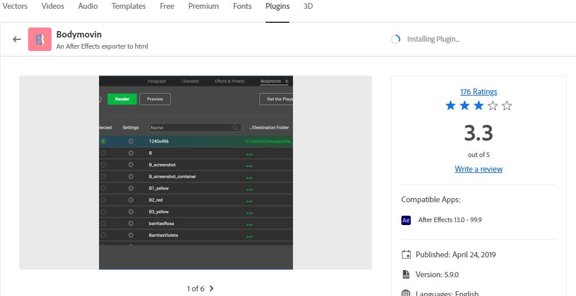
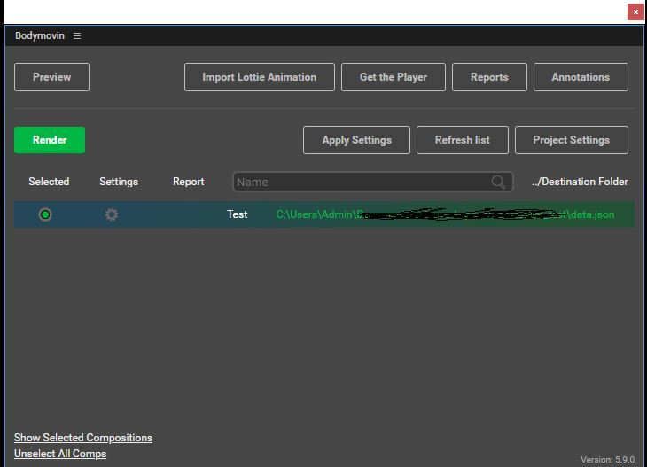
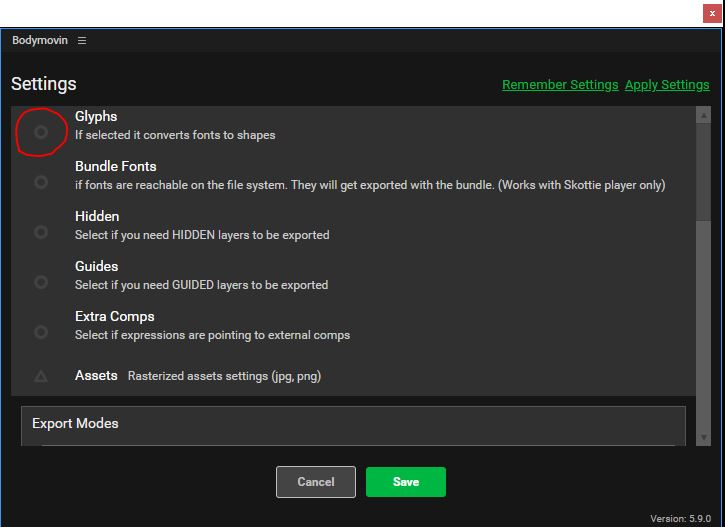
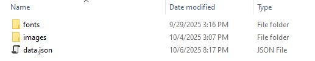

# Getting Started (Tutorial)

Follow the steps below to export your Adobe After Effects project for use with **Velocity**.

---

### 1. Install the Bodymovin Extension

Make sure the **Bodymovin** extension is installed in Adobe After Effects.  
You can find it in the **Creative Cloud Desktop App** under the **Plugins** section.

> 💡 Bodymovin is free to download and install.

---

---

### 2. Select the Composition to Export

1. Open your AE project.  
2. Make active the **composition** you want to export in the viewport.  
3. Open the **Bodymovin panel**, and select the target composition from the list of all compositions in the project.

*All **nested compositions** will be handled automatically by the exporter — no additional steps are required.*

---

### 3. Configure Text Export Settings (if applicable)

If your composition contains **Text layers**, you must adjust Bodymovin’s text export settings:

1. In the Bodymovin panel, click the **Settings (gear) icon** next to the “Selected” indicator.  
2. In the pop-up settings panel, **uncheck** the first option, **“Glyphs”**, then click the **green “Save”** button.  
   - By default, Bodymovin exports text as vector shapes because the standard Lottie player does not support fonts.  
   - Velocity, however, **does support font files**, and needs to know the exact font name used in each text layer.  
3. After saving, the settings panel will collapse.

---

### 4. Export the Composition

Click the **green “Render”** button to export the composition.

> ⚠️ **Important:** If this is your first time using Bodymovin, the export may fail because After Effects blocks plugins from writing files to disk by default.  
> To enable this:
>
> - Go to **Edit → Preferences → Scripting & Expressions**  
> - Check the box **“Allow Scripts to Write Files and Access Network”**

---

### 5. Export Font Files Correctly

If your project contains text layers and you unchecked “Glyphs” in Step 3, a **Font Settings** dialog will appear during export.

For each font used:

1. In the **Font Path** field, type the **font name exactly as it appears** in the AE **Text Settings panel**.  
   - Remove spaces if the name consists of multiple words.  
   - Case sensitivity is ignored, but the spelling must be exact.
2. You do **not** need to fill in any other fields in this dialog.

---

### 6. Bundle Font Files

This step is only required if the exported project contains text layers.

Once the export completes:

1. Locate the directory where Bodymovin saved the files.  
2. If you used **non-standard fonts**, bundle the corresponding font files.  
   - Place all font files in a folder named `fonts`, located alongside `data.json` (and the optional `images` folder).  
3. You can skip this step if only **standard fonts** (e.g., Arial, Times New Roman, Verdana) are used.  
   - See the **AE Support** page for a complete list of standard fonts.

*If you're unsure which fonts are standard, it's safe to bundle all fonts anyway.*

---

### 7. Zip the Exported Files

Before uploading to the API:

1. Verify the **integrity** of the exported files.  
2. Ensure all exported files from Bodymovin are contained in a **single folder**.  
3. Compress this folder into a `.zip` archive using any standard archiving tool (WinZip, 7-Zip, WinRAR, etc.).  
   - Only `.zip` format is currently supported.

---

### 8. Upload the Project to Your Velocity Account

Once your `.zip` file is ready, **upload it through your Velocity account dashboard or API** to begin rendering.